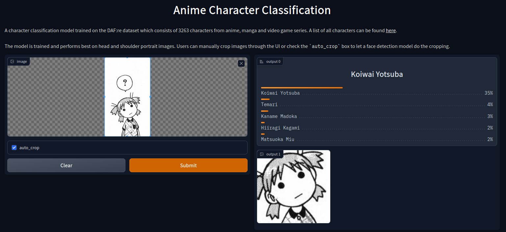

# Anime Character Classification
[](https://huggingface.co/spaces/bwconrad/anime-character-classification)

Code for training anime character classification models on the [DAF:re dataset](https://arxiv.org/abs/2101.08674) which contains 3263 classes. A fine-tuned BEiT-b/16 model achieves a test accuracy of 94.84\%.

## Demo

- A demo app for the model is available in the Huggingface Space [here](https://huggingface.co/spaces/bwconrad/anime-character-classification).
- It can also be run locally with `python app/app.py`.


## Requirements
- Python 3.8+
- `pip install -r requirements.txt`

## Data Preparation
- Download `dafre_faces.tar.gz` and `labels.tar.gz` from [here](https://drive.google.com/drive/folders/1S_T8R7gbY47dfRH9dUBXOstlOwVuMmXe?usp=sharing) and extract both into the same directory (e.g. `data/`).
- Process the dataset by running: `python scripts/process_defre.py -i data/`

## Usage
### Training
- [`configs/`](configs/) contains the configuration files used to produce the best model and can be run with:
```
python train.py --accelerator gpu --devices 1 --precision 16 --config path/to/config
```
- To get a list of all arguments run `python train.py --help`

##### Training examples
- In all examples `...` denotes typical options such as `--accelerator gpu --devices 1 --precision 16 --data.root data/dafre --max_step 50000 --val_check_interval 2000`.
<details><summary>Fine-tune a classification layer</summary>

```
python train.py ... --model.linear_prob true
```

</details>

<details><summary>Fine-tune the entire model initialize with a trained classifier (or entire model)</summary>

```
python train.py ... --model.weights /path/to/linear/checkpoint
```

</details>

<details><summary>Apply data augmentations</summary>

```
python train.py ... --data.erase_prob 0.25 --data.use_trivial_aug true --data.min_scale 0.8
```

</details>

<details><summary>Apply regularization</summary>

```
python train.py ... --model.mixup_alpha 1 --model.cutmix_alpha 1 --model.label_smoothing 0.1
```

</details>

<details><summary>Train with class-balanced softmax loss</summary>

```
python train.py ... --model.loss_type balanced-sm --model.samples_per_class_file  samples_per_class.pkl
```

</details>

<details><summary>Train with class-balanced data sampling</summary>

```
python train.py ... --data.use_balanced_sampler true
```

</details>

### Evaluate
To evaluate a trained model on the test set run:
```
python test.py --accelerator gpu --devices 1 --precision 16 --checkpoint path/to/checkpoint
```
- __Note__: Make sure the `--precision` argument is set to the same level as used during training.


## Results

| Model     | Top-1 Val Acc | Top-5 Val Acc | Top-1 Test Acc| Top-5 Test Acc| Configs | Weights | 
|:---------:|:-------------:|:-------------:|:-------------:|:-------------:|:------:|:--------:|
| BEiT-b/16 | 95.26         | 98.38         | 94.84         | 98.30         | [1](configs/dafre-linear.yaml)  [2](configs/dafre-ft.yaml) [3](configs/dafre-balanced-linear.yaml) | [Link](https://huggingface.co/bwconrad/beit-base-patch16-224-pt22k-ft22k-dafre)|

## Experiment Log
The training procedure of the above model can be outline as the following:
1. Starting from BEiT-b/16 pretrained weights (from [here](https://huggingface.co/microsoft/beit-base-patch16-224-pt22k-ft22k)), a linear classifier is trained for 50,000 steps with the rest of the weights frozen. [Random erasing](https://arxiv.org/abs/1708.04896) and [TrivialAugment](https://arxiv.org/abs/2103.10158) data augmentations are used. Fine-tuning only the classifier first can help make full fine-tuning more stable when a domain-shift exists between the pretraining and fine-tuning datasets. This model achieves a top-1 validation accuracy of 75.72\%.
    - [Config](config/dafre-linear.yaml)
2. Starting from the linear classifier checkpoint, the entire model is fine-tuned for 50,000 steps. [Random erasing](https://arxiv.org/abs/1708.04896) and [TrivialAugment](https://arxiv.org/abs/2103.10158), [Mixup](https://arxiv.org/abs/1710.09412), [Cutmix](https://arxiv.org/abs/1905.04899) and [Label Smoothing](https://arxiv.org/abs/1906.02629) are used. This model achieves a top-1 validation accuracy of 94.93\%.
    - [Config](config/dafre-ft.yaml)
3. To improve performance on the tail classes, class-balanced classifier re-training (cRT) is done following [Kang et. al](https://arxiv.org/abs/1910.09217v2). The classifier is further fine-tuned for 10,000 steps using a class-balanced data sampler with the all other weights frozen. [Random erasing](https://arxiv.org/abs/1708.04896) and [TrivialAugment](https://arxiv.org/abs/2103.10158), [Mixup](https://arxiv.org/abs/1710.09412), [Cutmix](https://arxiv.org/abs/1905.04899) and [Label Smoothing](https://arxiv.org/abs/1906.02629) are used. This model achieves a top-1 validation accuracy of 95.26\%. The improvement on tail classes is only marginal and further exploration in dealing with long-tailed data is still required.
    - [Config](config/dafre-balanced-linear.yaml)

##### Observations:
- The DAF:re dataset is noisy with many near and exact duplicates, mislabeled images and some vague/generic classes (e.g. mage, elven).


## Acknowledgement
The face detector used in the Gradio app is taken from [nagadomi's repo](https://github.com/nagadomi/lbpcascade_animeface).
